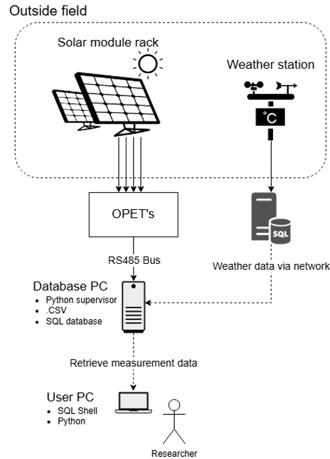

# TUD-PV-monitoring-tool
PV monitoring tool for the TU Delft. It makes use of the OPET modules to collect measurement data and combines it with weather measurement data. This data then gets uploaded to a PostgreSQL database. This document will show you the database structure and how it works. 

## System
The system is set up as can be seen in the picture below. First, the OPET, i.e., measurement instruments, collect the data and save it as a CSV file on the server. This includes curve and point measurements. The server that is on Windows runs the PostgreSQL database. The weather data also gets pulled to this server and matched. The weather data is stored on an older server from LPVO, which runs MySQL. This server is accessed over the network, so you need to forward the ports to it. If it is not possible to open up the firewall or connect over the network, we would advise using a vpn service like [Tailscale](https://tailscale.com/). For this to work, you need to set up a subnet on the old server from which you want to get the weather data. From the server that runs PostgreSQL, data can be downloaded so that the collected data can be studied. 



## Database structure
The database contains 4 tables: 'pv_point', 'pv_curve', 'weather', and 'modules'. These tables get linked via some variables. The 'pv_point' and 'pv_curve' tables get linked to the 'modules' table via the variable 'module_name'. This means that if a module is not added to the modules list, data for that module cannot be collected. To add a module to the list, you need to add it to the 'measurement_config.json'. The 'pv_point' and 'pv_curve' tables get linked to the 'weather' table via the 'weather_id'. The system checks whether there were any weather measurements in the past 5 minutes and assigns the most recent weather_id of the weather measurement to the point/curve measurement.
> [!Caution]
>  All the fields of the 'measurement_config.json' must be filled in; otherwise, the system will break down. To leave space blank fill in:"".


## Setup
Things that need to be installed on the server to run the system:
* [Python](https://www.python.org/downloads/) (Get the most recent fully supported version, i.e., no pre-release)
* [PostgreSQL](https://www.postgresql.org/download/) 
* [pgvector](https://github.com/pgvector/pgvector) (This enables curve measurements to be stored in a vector)
* `pip install psycopg2`
* `pip install psycopg2-binary`
* `pip install pandas`
* `pip install serial`
* `pip install mysql-connector-python`
When all these programs are installed, and the database has been set up using the PostgreSQL installer, the program 'pyt_to_SQL.py' can be used to continue the setup. The tables for data storage can be created using the function `create_table(type, conn, cur)`. This needs to be done for the types: 'pv_point', 'pv_curve', 'weather', and 'modules'. Running the following code does that: 
```python
conn, cur, mysql_conn, mysql_cur, config, data_path_base = init()
create_table('pv_point', conn, cur)
create_table('pv_curve', conn, cur)
create_table('weather', conn, cur)
create_table('modules', conn, cur)
db_close(conn)
```

> [!TIP]
> These functions are stored in 'pyt_to_SQL.py'; it is advised to run this code in a different file, so you do not accidentally destroy the code. Do this by adding `from pyt_to_SQL import init, create_table, db_close` at the top of your file.
When you have completed all previous steps, you can start using the database by running 'TUD-opet-supervisor.py'.


