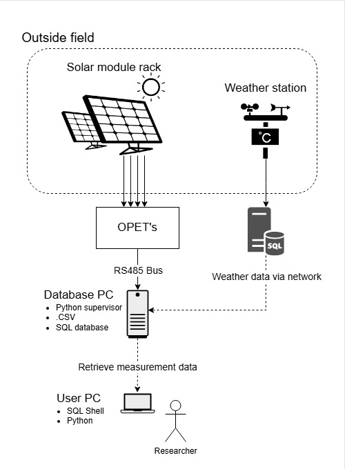
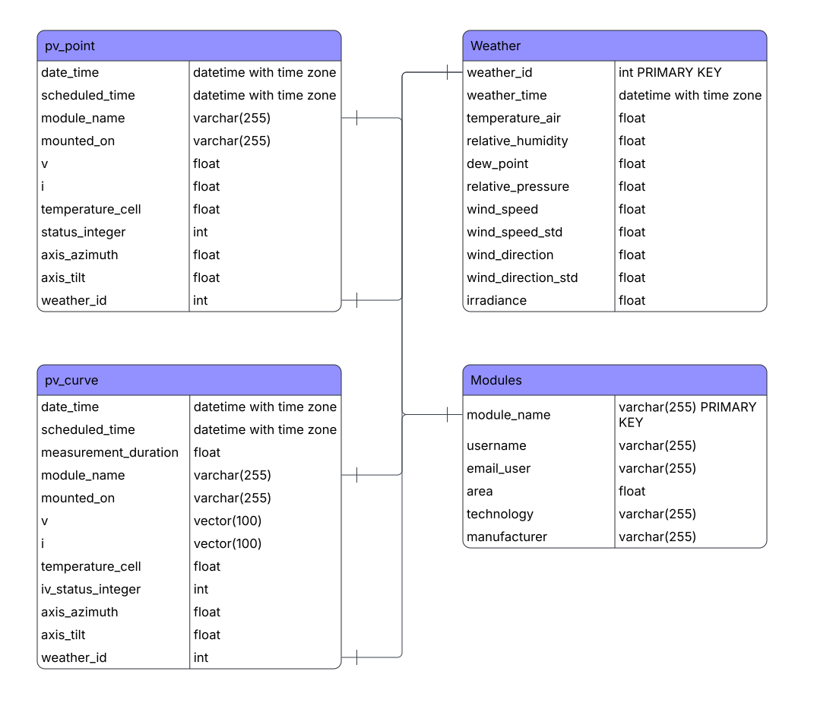

# TUD-PV-monitoring-tool
PV monitoring tool for the TU Delft. It makes use of the OPET modules to collect measurement data and combines it with weather measurement data. This data then gets uploaded to a PostgreSQL database. This document will show you the database structure and how it works. 

## System
The system is set up as can be seen in the picture below. First, the OPET, i.e., measurement instruments, collect the data and save it as a CSV file on the server. This includes curve and point measurements. The server that is on Windows runs the PostgreSQL database. The weather data also gets pulled to this server and matched. The weather data is stored on an older server from LPVO, which runs MySQL. This server is accessed over the network, so you need to forward the ports to it. If it is not possible to open up the firewall or connect over the network, we would advise using a vpn service like [Tailscale](https://tailscale.com/). For this to work, you need to set up a subnet on the old server from which you want to get the weather data. From the server that runs PostgreSQL, data can be downloaded so that the collected data can be studied. 



## Database structure
The database contains 4 tables: 'pv_point', 'pv_curve', 'weather', and 'modules'. These tables get linked via some variables. The 'pv_point' and 'pv_curve' tables get linked to the 'modules' table via the variable 'module_name'. This means that if a module is not added to the modules list, data for that module cannot be collected. To add a module to the list, you need to add it to the `measurement_config.json`. The 'pv_point' and 'pv_curve' tables get linked to the 'weather' table via the 'weather_id'. The system looks for the closest in time weather measurement to the OPET measurement. The criteria are that the weather measurement has taken place in a timespan of 5 minutes around the 'date_time'. If the gap is larger than 5 minutes, the weather_id 0 will be assigned. If there have been measurements in the time span of 5 minutes, then the closest in time weather_id will be assigned. This system does mean that the OPET measurements must have been 5 minutes ago to assign the closest weather measurement, so there is a delay. When an OPET measurement has a 'weather_id' that says Null or None, then a 'weather_id' is yet to be assigned.

> [!Warning]
>  Only the 'module_name' field of the `measurement_config.json` must be filled in; otherwise, the system will break down. It is very much recommended to fill in all possible settings in the `measurement_config.json`.



## Setup
Things that need to be installed on the server to run the system:
* [Python](https://www.python.org/downloads/) (Get the most recent fully supported version, i.e., no pre-release)
* [PostgreSQL](https://www.postgresql.org/download/) 
* [pgvector](https://github.com/pgvector/pgvector) (This enables curve measurements to be stored in a vector)
* `pip install psycopg2`
* `pip install psycopg2-binary`
* `pip install pandas`
* `pip install serial`
* `pip install mysql-connector-python`
* `pip install setuptools`
* `pip install psycopg2 pgvector`
* `pip install scipy`
* `pip install matplotlib`
* `pip install pyserial`

When all these programs are installed, and the database has been set up using the PostgreSQL installer, the program `pyt_to_SQL.py` can be used to continue the setup. 
The first thing that needs to be done is to configure your database in `init()` in `pyt_to_SQL.py`. Here, you need to fill in the database name, the username, the user password, the IP address of the server (if the database is run on the same computer, 'localhost' will work), and the port through which it can be accessed. The same needs to be done for the MySQL database. The function is `mysql_init()` in `Weatherdb_to_pyth.py`.

Do not forget to make an account for remote access for users and open the port on your server. These users should be granted privileges to select and execute. If you can trust them you can grant them access to all. 

The tables for data storage can be created using the function `create_table(type, conn, cur)`. This needs to be done for the types: 'pv_point', 'pv_curve', 'weather', and 'modules'. Running the following code does that: 
```python
conn, cur, mysql_conn, mysql_cur= init()
create_table('pv_point', conn, cur)
create_table('pv_curve', conn, cur)
create_table('weather', conn, cur)
create_table('modules', conn, cur)
db_close(conn)
```

For remote access, you may want to make an additional user and grant them access to the database.
> [!TIP]
> These functions are stored in `pyt_to_SQL.py`; it is advised to run this code in a different file, so you do not accidentally destroy the code. Do this by adding `from pyt_to_SQL import init, create_table, db_close` at the top of your file.

For the error detection service to work and to actually send an email, you will need to set up your SMTP email address. In the function `send_mail(...)` in `pyt_to_SQL.py`, the email address, SMTP server, port, and app password need to be configured. 

The next step is to configure the JSON files properly. To see this, open the foldable example-config-test under the header [File descriptions](#file-descriptions). 
When you have completed all previous steps, you can start using the database by running 'TUD-opet-supervisor.py'.

>[!IMPORTANT]
> The entire script is made for the timezone in 'Europe/Amsterdam'. So if you are using this program in a different timezone, you need to very carefully adapt the timezones in the code.

## Users
In order to use the database, you first need to add your solar module to `measurement_config.json`. This is done on the computer that runs the database! So first, you install the solar module you want to start measuring, and then you add it to the measurement config file. You must do this securely and make sure to take a look at the example. Once the data is set, it gets uploaded to the database, and once it has been uploaded, you cannot change the data except for the tracer, username, and the user_email. See in the file the description of the config for more details.
If you want to stop a measurement, you either need to set disabled to TRUE in the `measurement_config.json` or just completely remove the module from that file.

To access the database from your local computer, you need to make sure that the function `init()` contains the correct IP address of the machine. You also need to know the name of the database, your username, your password, and the port through which it is accessible.  

Data can be extracted using `download.py`, which can be found in the user_tools. This command either the 'pv_point' or 'pv_curve' data with the weather data. You also need to set a start and stop date, which acts as a filter for your data. Lastly, you need to select the solar modules you want to have. The data that you get is not perfectly on a single timestamp, because the OPET measurements take place at a different time compared to the weather measurements. This data gets synced based on the closest measurement within a 5-minute time difference compared to the opet data. 


## File descriptions
Here are some high-level descriptions of each document. To fully understand the code, you will have to look into the Python file for more specific explanations. 

<details>
    <summary><b>TUD_opet_supervisor.py</b></summary>
    <p>This document is the heart of the operation. It schedules functions in the code. It plans the measurements and plans the updates of the database.</p>
</details>

<details>
  <summary><b>opet_supervisor_config.json</b></summary>
    <p>This document contains the information on where the data, logs, and configurations can be found.</p>
</details>

<details>
    <summary><b>test_log</b></summary>
    <p>This folder contains the data from the measurements and stores the log files.</p>
</details>

<details>
    <summary><b>config</b></summary> 
    <p> This folder contains all the settings that need to be set up when a new solar module is connected. An example of a config can be found in the folder <code>example_config</code>. <br>
        In <code>measurement_config.json</code>, data about the solar module must be added. Do this very carefully because a lot of data is stuck in the database table 'modules' after being set. <br>
        The following fields need to be filled in for each solar module
        <ul>
            <li>module_name (string)(This one needs to be unique for every different module, and it must be filled in; otherwise, the system will not work.</li>
            <li>mounted_on (string)</li>
            <li>tracer (string)</li>
            <li>interval_point (int)</li>
            <li>interval_curve (int)</li>
            <li>username (string) (can be changed later)</li>
            <li>user_email (string) (can be changed later)</li>
            <li>area ($m^2$) (float) (cannot be changed later)</li>
            <li>technology (string) (cannot be changed later)</li>
            <li>manufacturer (string) (cannot be changed later)</li>
            <li>disabled (boolean)</li>
            <li>stopdate ('yyyy-mm-dd' or Null)</li>
            <li>load_mode (string)</li>
        </ul>
        Also, the mounted mechanisms have to be set up. The name of the mounting is the selector in which the <code>axis_azimuth</code> and the <code>axis_tilt</code> are stored for each mounting.
        The <code>data_destination</code> has to be configured. This is where the output of the OPET measurements gets stored. <br>
        Lastly, the admins' email addresses have to be configured. If you have multiple emails, they need to be in a single string. This enables the error detection to send every email that is being sent by <code>error_detect()</code> to the admin/maintainer of the system. <br><br>
        In <code>opet_bus_info.json</code>, the serial number of the USB to RS-485 adapter needs to be listed. This serial number can be found using <code>port_finder.py</code>. If you have multiple USB adapters, you need to do this multiple times and start at 'a', 'b', 'c',... <br><br>
    Lastly, the <code>opet_info.json</code> needs to be set up. This contains the tracers that need to be named according to the following format 'O001', where the number increases with the tracer. The rest contains the bus that the tracer is on and the address of the OPET.
    </p>
</details>

<details>
    <summary><b>OPET_control</b></summary>
    <p>This folder contains the <code>OPET_control.py</code>. This piece of code acts as the translation layer between the OPETs and the <code>TUD-opet-supervisor.py</code>. This control mechanism is pulled from <a href='https://github.com/NatLabRockies/opet-control?tab=readme-ov-file'>opet-control</a>. We have made some slight changes, but it is mostly the same. The most important addition is that we also measure the solar cell temperature. To get further insight into how this translation layer works, look into <a href='https://github.com/NatLabRockies/opet-firmware'>opet-firmware</a>.
    </p>
</details>

<details>
    <summary><b>user_tools</b></summary>
    <p> This folder contains programs that can be used by the users to set up or extract data. <code>plot_csv.py</code> plots a couple of measurements. <br>
        In <code>port_finder.py</code>, you can find the code that enables you to find the port of your USB adapter. <br>
        The <code>download.py</code> enables users to extract the measurement data they want. They can filter by startdate, stopdate, and module_name. <br>
        The <code>lifedata.py</code> enables users to make a plot of the most recent incoming datapoint for their PV module and check whether it is what they expect.
    </p>
</details>

### supervisor_tools
This folder contains documents that help the operation of the <code>TUD-opet-supervisor.py</code>
<details>
    <summary><b>supervisor_tools.py</b></summary> 
    <p>
        In <code>opet_supervisor_tools.py</code>, the code that performs the point and curve measurements can be found, and the program that writes the collected data to a CSV file. <br>
    </p>
</details>
    
<details>
    <summary><b>pyt_to_SQL.py</b></summary>
    <p>
      This document contains all the operations that update the PostgreSQL database. <br><br>
      Firstly, to do any operations with the database, a connection needs to be made. This is done using <code>init()</code>. After using the program, it needs to be shut down <code>db_close(conn)</code> <br>
      It contains the looping functions such as: <code>daily_loop()</code> and <code>update_loop()</code>. It also contains the mechanism to add the collected data to all the tables: <code>add_data(...)</code>, <code>add_module_data(...)</code>, <code>add_weather_data(...)</code>, <code>past_data_upload(...)</code>. <br> <code>past_data_upload(...)</code> uploads the data from the past; it looks back a certain number of days. How many days you want it to look back can be configured in the `measurement_config.json`. The default is 7 days. <br>
      The folder also contains an error detection service <code>error_detect(...)</code> that can detect whether any information has been received in the past 24 hours for the entire database or per solar module. It also collects the number of status_integer errors relative to the total amount of measurements for each module in the past 24 hours for the point measurements. It sends an email <code>send_mail(...)</code> to the admins and owner of the solar module when a problem has been detected. <br>
      This also contains multiple programs to print, check, or delete the tables, but this is meant for debugging purposes. <br>
      Lastly and most importantly for most users, it contains the function <code>download_table(...)</code>. This function can be used to extract measurements between 2 dates for multiple solar modules at once. 
    </p>
</details>

<details>
    <summary><b>Weatherdb_to_pyth.py</b></summary>
    <p>
      This document contains various ways of extracting information from the weather database that runs on MySQL. <br><br>
      Firstly, it again has to establish a connection with the MySQL database <code>mysql_init()</code> and at the end we use <code>mysql_close(conn)</code> <br>
      The other function can collect all the weather data from a specific start date <code>weather_all(...)</code>, collect the last measurement <code>weather_last(...)</code>, or collect the data from the last 24 hours <code>download_weather_last24hours(...)</code>. 
    </p>
</details>

